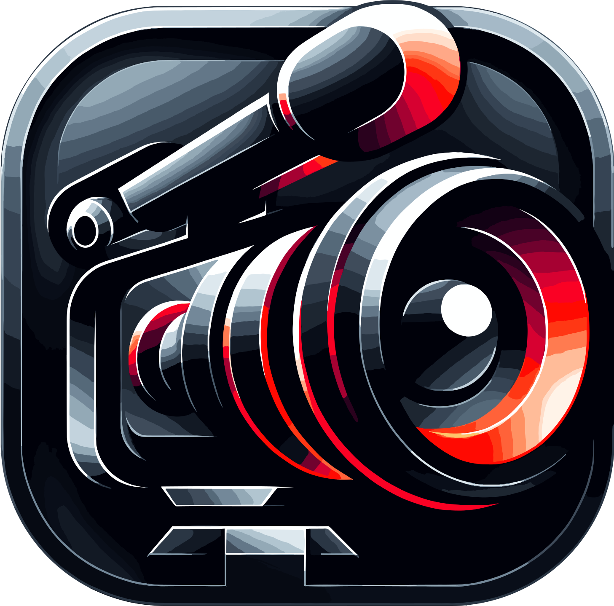

# Mac-Recorder
## The Comprehensive Recording Suite for MacOS

    

Welcome to **Mac-Recorder**, a part of the MacUtilities suite - the all-in-one recording solution engineered for MacOS. From professional-grade audio-visual capture to advanced settings for content creators, Mac-Recorder, along with its companion utilities like brightness control, fan boost, and Mac cleaner, provides unmatched versatility and quality.

---

### 🌟 **Key Features of Mac-Recorder:**

#### 🖥️ **Screen Recording**
- **Full-Screen Capture**: Record your entire screen with a click.
- **Selective Area Recording**: Focus on a specific area or window.
- **Multi-Monitor Support**: Seamlessly record across multiple screens.

#### 📷 **Camera Recording**
- **High-Resolution Recording**: Capture crisp, clear video.
- **Camera Overlay**: Add a camera feed overlay.
- **Green Screen Effect**: Utilize chroma keying for backgrounds.

#### 🎙️ **Audio Recording**
- **High-Quality Voice Recording**: Capture your voice with clarity.
- **System Audio Capture**: Record internal audio from your MacOS.
- **Audio Mixing**: Blend voice and system audio.

---

### ⚙️ **Advanced Settings and Customizations:**

Click to Expand

1. **Frame Rate Adjustment**: Tailor frame rate for smooth recordings.
2. **Resolution Settings**: Choose from various recording resolutions.
3. **Compression Options**: Manage file sizes with compression settings.
4. **Scheduled Recording**: Automate recording start and stop times.
5. **Cursor Highlighting**: Enhance cursor visibility for tutorials.
6. **Annotation Tools**: Annotate and draw on recordings in real-time.
7. **Watermark Integration**: Personalize recordings with custom watermarks.
8. **Hotkey Customization**: Configure shortcuts for quick actions.
9. **File Format Selection**: Save in formats like MP4, MOV, AVI.
10. **Cloud Integration**: Upload recordings directly to cloud storage.
11. **Live Streaming Capabilities**: Broadcast live to platforms like YouTube.
12. **Interactive Recording**: Interact with live audience comments.
13. **VR and AR Support**: Capture virtual and augmented reality content.
14. **Dual Audio Input**: Record from two audio sources at once.
15. **Automated Transcription**: Convert voice recordings to text.
16. **Multi-Language Support**: Use Mac-Recorder in various languages.
17. **Gesture Recording**: Capture touchpad and mouse gestures.
18. **Battery Saver Mode**: Optimize for battery efficiency.
19. **Scene Transitions**: Smooth transitions for professional effects.
20. **Export to Editing Software**: Direct exports to video editors.

---

### 📦 **Installation Options for Mac-Recorder:**

Mac-Recorder can be downloaded as a standalone application or as part of the comprehensive MacUtilities suite, which includes tools for brightness control, fan boosting, and system cleaning.

- **Install via Homebrew**:
  - For Mac-Recorder only: `brew install --cask mac-recorder`
  - For the full MacUtilities suite: `brew install --cask mac-utilities`
- **Download Mac-Recorder**: [Download Link](#download-link)

---

### 🐞 **Bug Reporting and Feature Requests:**

- **Report Bugs**: Help us improve by reporting issues. [Report a Bug](#bug-report-link)
- **Request Features**: Share your ideas for new features. [Request a Feature](#feature-request-link)

---

### 💬 **Community and Support:**

- **User Forum**: Engage with other users. [Visit Forum](#user-forum-link)
- **FAQs**: Get answers to common questions. [Read FAQs](#faqs-link)
- **Customer Support**: Contact us for assistance. [Contact Support](#contact-support-link)

---

### 🗓️ **Release History and Updates:**

- Explore our development journey. [View Release History](#release-history-link)

---

### 🌐 **Contribute to Localization:**

- **Join Our Translation Team**: Help localize Mac-Recorder. [Contribute to Localization](#localization-contribution-link)

---

**Mac-Recorder**, as part of the MacUtilities suite, is your gateway to professional-level recording on MacOS, ensuring that your digital creations are captured with precision and ease.
