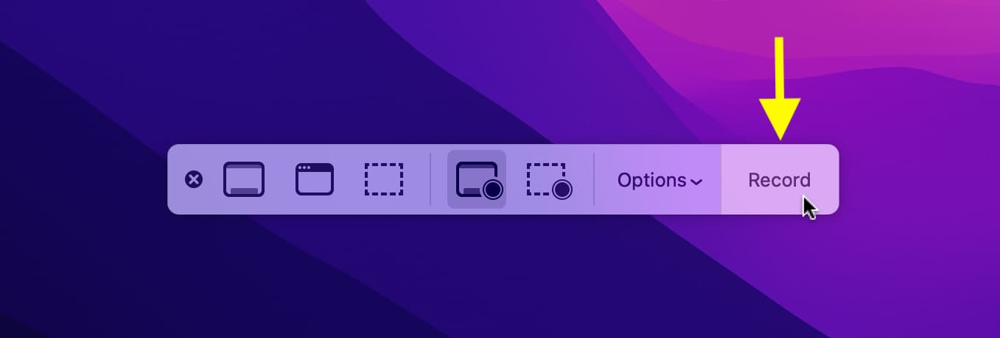

# Mac-Recorder
## The Comprehensive Recording Suite for MacOS

    

Welcome to **Mac-Recorder**, a part of the MacUtilities suite - the all-in-one recording solution engineered for MacOS. From professional-grade audio-visual capture to advanced settings for content creators, Mac-Recorder, along with its companion utilities like brightness control, fan boost, and Mac cleaner, provides unmatched versatility and quality.

---

### 🌟 **Key Features:**

#### 🖥️ **Screen Recording**
- Full-Screen Capture: Record your entire screen with a click.
- Selective Area Recording: Focus on a specific area or window.
- Multi-Monitor Support: Seamlessly record across multiple screens.

#### 📷 **Camera Recording**
- High-Resolution Recording: Capture crisp, clear video from any connected camera.
- Camera Overlay: Add a camera feed overlay to your screen recordings.
- Green Screen Effect: Utilize chroma keying for professional backgrounds.

[//]: # (![High-Resolution Recording]&#40;assets/recording.jpg&#41;)

#### 🎙️ **Audio Recording**
- High-Quality Voice Recording: Capture your voice with clarity.
- System Audio Capture: Record internal audio from your MacOS.
- Audio Mixing: Blend voice and system audio seamlessly.

[//]: # (![High-Quality Voice Recording]&#40;assets/recording.jpg&#41;)

#### 🔊 **Advanced Audio Features**
- Noise Reduction: Reduce background noise for clear audio.
- Equalizer Controls: Fine-tune audio with advanced equalizer settings.
- Audio Enhancements: Apply filters for enhanced sound quality.

[//]: # (![Noise Reduction]&#40;assets/recording.jpg&#41;)

---

### ⚙️ **Advanced Settings and Customizations:**

Click to Expand

1. **Frame Rate Adjustment**: Customize the frame rate for smooth recordings.
2. **Resolution Settings**: Choose different resolutions for your recordings.
3. **Compression Options**: Optimize file size with various compression settings.
4. **Scheduled Recording**: Set a timer to start and stop recordings automatically.
5. **Cursor Highlighting**: Make your cursor stand out for instructional content.
6. **Annotation Tools**: Draw and annotate on your recordings in real-time.
7. **Watermark Integration**: Add custom watermarks to your recordings.
8. **Hotkey Customization**: Set custom shortcuts for efficient control.
9. **File Format Selection**: Save recordings in multiple formats (MP4, MOV, AVI, etc.).
10. **Cloud Integration**: Automatically upload recordings to cloud storage.
11. **Live Streaming Capabilities**: Stream your recordings live to platforms like YouTube and Twitch.
12. **Interactive Recording**: Engage with your audience through live comments.
13. **VR and AR Support**: Record in virtual and augmented reality environments.
14. **Dual Audio Input**: Record from two audio sources simultaneously.
15. **Automated Transcription**: Generate transcripts from your voice recordings.
16. **Multi-Language Support**: Interface available in various languages.
17. **Gesture Recording**: Capture touchpad and mouse gestures.
18. **Battery Saver Mode**: Optimize recording settings for battery efficiency.
19. **Scene Transitions**: Add smooth transitions between recording scenes.
20. **Export to Editing Software**: Directly export recordings to popular video editing software.

---

### 📦 **Installation Options for Mac-Recorder:**

Mac-Recorder can be downloaded as a standalone application or as part of the comprehensive MacUtilities suite, which includes tools for brightness control, fan boosting, and system cleaning.

- **Install via Homebrew**:
  - For Mac-Recorder only: `brew install --cask mac-recorder`
  - For the full MacUtilities suite: `brew install --cask mac-utilities`
- **Download Mac-Recorder**: [Download Link](#download-link)

---

### 🐞 **Bug Reporting and Feature Requests:**

- **Report Bugs**: Found an issue? Let us know here for a chance to earn a **Free Premium Subscription**.
  [Report a Bug](#bug-report-link)
- **Request Features**: Have ideas to improve Mac-Recorder? Submit your suggestions!
  [Request a Feature](#feature-request-link)

---

### 💬 **Community and Support:**

- **User Forum**: Join the discussion and connect with other users.
  [Visit Forum](#user-forum-link)
- **FAQs**: Find answers to common questions.
  [Read FAQs](#faqs-link)
- **Customer Support**: Need help? Contact our dedicated support team.
  [Contact Support](#contact-support-link)

---

### 🗓️ **Release History and Updates:**

- Stay updated with our latest releases and feature updates.
  [View Release History](#release-history-link)

---

### 🌐 **Contribute to Localization:**

- **Join Our Translation Team**: Help us make Mac-Recorder accessible globally. Contributors are rewarded with a **Free Premium Subscription**.
  [Contribute to Localization](#localization-contribution-link)

---

Mac-Recorder is more than just a recording tool - it's a gateway to capturing and sharing your digital world with ease and professionalism.